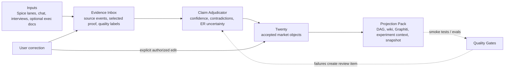

# ADR 0002: Operating Ontology Spine

Date: 2026-05-09

Status: accepted

## Context

The system needs one accepted-state path, with many generated projections. The
previous POC path allowed generated artifacts to look authoritative because
they were easier to read or query than the operational record store.

The operating spine is:



## Decision

Twenty accepted records are the canonical accepted market state.

`market-ontology` owns the schema contract and projection shape. It is not a
runtime database.

`spice-harvester` owns collection, source provenance, evidence candidates, and
claim adjudication inputs. Spice lanes produce candidates, not accepted state.

`ai-chatbot` owns product workflows, chat corrections, Sizzle UI, accepted-state
readback, and Projection Pack consumers.

Generated outputs are grouped as one Projection Pack:

- `ontology_snapshot`
- Sizzle DAG data
- wiki/dossier
- Graphiti/Falkor projection
- experiment context
- manifest/hash

## Source Of Truth Policy

Canonical accepted state:

- Twenty accepted records

Not canonical:

- wiki
- dossier
- `kg_seed`
- `ontology_snapshot`
- Graphiti/Falkor
- Zep
- Sizzle DAG
- raw chunks
- chat transcript
- PageIndex
- Rowboat

These are inputs, candidate stores, projections, memory layers, or views.

## Correction Loop

Ambiguous correction:

```text
chat correction -> Evidence Inbox -> Claim Adjudicator -> review or accepted Twenty update
```

Explicit authorized edit:

```text
chat correction -> correction source event -> Twenty accepted record update -> Projection Pack regeneration
```

Every accepted correction still creates evidence/provenance.

## Quality Loop

Projection Pack generation must run smoke checks before downstream use:

- accepted records appear in generated outputs
- candidate records are excluded from experiment context by default
- conflicted claims are labeled
- snapshot hashes are deterministic
- projection consumers do not read wiki, `kg_seed`, Graphiti, Zep, raw chunks, or DAG data as accepted truth

Failures route back to the Claim Adjudicator or a human review item.

## Deprecation Matrix

| Old path | New status | What remains | Removal gate |
|---|---:|---|---|
| Wiki as canon | Deprecated | Generated narrative projection | Projection Pack regenerates wiki from Twenty |
| `kg_seed` as canonical facts | Deprecated | Compatibility source material, then generated `ontology_snapshot` | Twenty-to-snapshot projection validates |
| Graphiti/Falkor as truth | Demoted | Retrieval/memory projection | Results carry status and provenance |
| Sizzle DAG as truth | Demoted | Accepted structure view | DAG reads Projection Pack |
| Raw chunks as evidence | Demoted | Raw extraction material | Evidence Inbox stores selected proof |
| `wiki/claims.jsonl` | Deprecated | Compatibility adapter only | ClaimCandidate ledger works |
| Direct Spice accepted writes | Deprecated | Candidate evidence and claims only | Claim Adjudicator exists |
| Zep as ontology memory | Rejected | Per-exec chat memory only | Immediate policy |
| PageIndex core path | Removed from core | Optional long-doc experiment | Parking lot only |
| Rowboat core path | Removed from core | Optional future input lane | Parking lot only |
| LinkML immediate migration | Deferred | Future schema-authoring upgrade | Accepted-state path stabilizes |

## Consequences

The project may keep old files for auditability, demos, and compatibility, but
they must lose authority. Each consumer must know whether it is reading input,
candidate, accepted, projection, memory, or legacy data.

New spine work is incomplete unless it demotes, warns on, redirects, or removes
at least one old authority path.
